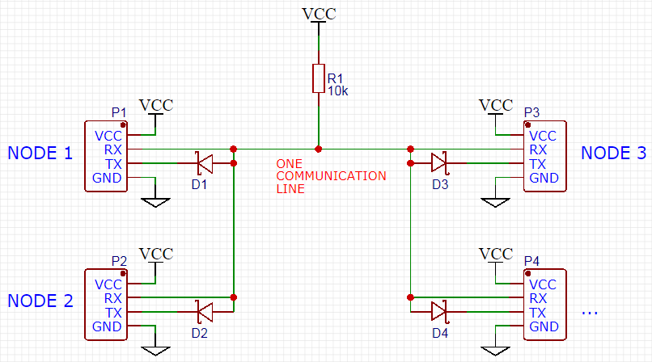

*************************
D2D - Hardware connection
*************************

Layer 1: Physical Layer overview
--------------------------------
The **D2D** library provides an example of **L1** hardware connection
with the use of an **UART** microcontroller interface. In general the library
**Physical Layer** is responsible for:

    - Sending bytes over the medium
    - Receiving bytes over the medium
    - (Optional) Collision detection
    - Medium interface error detection
    - Frame CRC calculation and verification

Hardware circuit
----------------
Example solution of **L1** uses standard **UART interface** for sending signals
between the devices. This decision gives simplicity and enables
easy portability of the software for different microcontrollers. The
simpliest hardware connection between the Nodes is shown below. It uses
standard **UART** interface with **RX** and **TX** lines.

The **Physical Layer** implementation depends completely on the use cases, so
that one can utilize different transmission medium like wireless or
wire serial communication.

What next
---------
Go to the next article to find out how to setup **D2D** library.

**Footnote**

**kaeraz**, 2019/02
