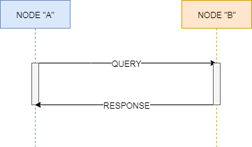
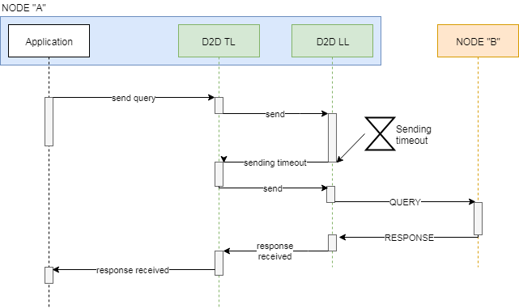
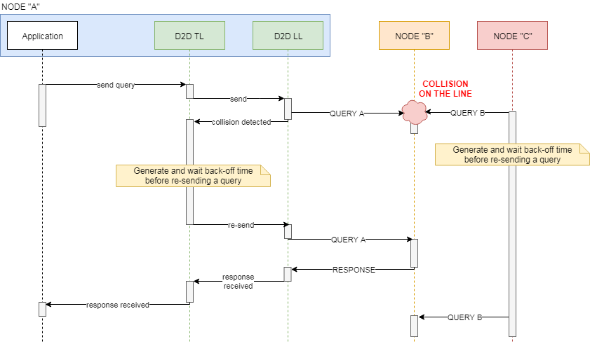
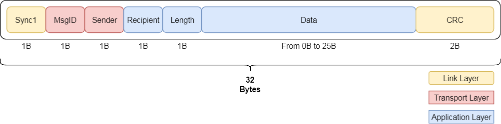

******************
D2D - Introduction
******************

Introduction
------------
**Devices to Devices** (**D2D**) is a library for communication
from **Devices** to **Devices**. It uses single write hardware
connection that reduces amount cables. The library supports
a Mutli-Point (Mutli-Master) topology and it is easy to used
with different microcontrollers. The application protocol can
be defined, as it is not imposed on the user. The Physical Layer
implementation depends completely on the uses, so that the library
may be used to transmit data by serial interfaces and wireless
interfaces as well.

It is intended for the embedded systems like:

    - IoT devices
    - Various types of robots
    - Home Appliance devices (Washers, Dryers, Fridges, ..)
    - etc.

that contain or interface several Nodes.

The main features of the **D2D** are:

    - Portability (written in simple C)
    - Multi-master (Multi-point) solution (any device can send to any device with
      one common cable for all)
    - Reduction of hardware connections (simple transmission and reception
      circuit)
    - Supports frames collision and handling
    - Layered design easy to plug-in on each level

.. note::

    The **D2D** library can be used for the interfaces that supports
    **peer-to-peer** model on the **Physical Layer**. The addressing
    is done inside the library within frame header.

Communication scheme
--------------------
The **D2D** library assumes the request and response communication scheme.
**Request** is called **Query** and **Response** is just called **Response**. The
communication scenario is depicted on the below picture.

.. note::

    - Request message is called **Query**.
    - Response message is called **Response** (to the Query).

The Node ``A`` sends a **Query** to the Node ``B`` and Node ``B`` responds to
Node ``A`` with a **Response**.

In case of a **Query** sending failure, the seneder re-transmits the **Query**
to the recipient. Number of the re-transmissions is settable in the library.
There are two types of sending failure:

    - Sending timeout
    - (Optional) Sending collision

**Sending timeout** happens when after giving a send request to the library,
the frame cannot be sent because of e.g. lack of peripheral resources. In that
case the **Link Layer** informs upper layers about such event and re-transmission
is performed. The re-transmission is executed immediatelly after timeout expiration.

**Sending collision** describes a case when **Link Layer** is informed about a collision
during sending the data over the medium. In **UART** example it is possible, because
the transmitted signal (TX line) goes back in a loop to the sender (RX line). This echo
signal is used to compare transmitted and received byte. If collision happens
the **Link Layer** informs upper layers about such event and re-transmission is performed.
Re-transmission is executed after some time which is called a back-off time. The back-off
time is generated randomly, so that it reduces possibility of next collision.

.. note::

    In contrary to the **Query**, there is no **Response** re-transmission. It implies
    that when the **Response** was not sent properly by some Node, it waits for the
    **Query** sender to re-transmit the **Query**. When **Query** arrives the receiving
    Node has a chance to send a **Response** once again.

Messages format
---------------
The **Query** and **Response** messages have common format which is shown below. There is no
differentiation between a **Query** and **Response**. The **Response** data content
depends completely on the user, so that the user may decide to carry some useful
information or send just zero-length data as a **Response**. The zero-length
response may be assumed as an acknowledge. In genral, when the **Response** does not
come back, it means that the sender has to re-transmit the **Query**.

The colored blocks tells what **D2D** layers are responsible for what data parts. The
message contains following fields:

    - ``Sync1`` - Frame synchronization byte (**0xAE**)
    - ``MsgId`` - Message identification number. The **MsgId** is the same for
      the **Query** and **Response**.
    - ``Sender`` - Sender Node address.
    - ``Recipient`` - Recipient Node address.
    - ``Length`` - Number of ``Data`` bytes.
    - ``Data`` - User data bytes.
    - ``CRC`` - Checksum value that prevents from receiving distorted frames.

The ``MsgId`` field play an important part in the messaging strategy. All the **Responses**
and all the **Query** re-transmitions shall carry the same ``MsgId`` value. The only
exception is when one of the Nodes had an internal issue during the valid communication.

Messaging suggestions
---------------------
In a **Query** recipient Node point of view, if receives a valid **Query** and responds
to it with a **Response**, it shall wait at least one **re-transmission timeout**, and
after that time it can sure that the **Query** sender Node received its response properly.

However if a **Query** sender Node during receiving a **Response** had an internal issue
(e.g. HW reset), it shall send the **Query** again to the recipient Node. In that situation
the **Query** recipient Node might think that the **Response** to the first **Query** had been
delivered back successfully. If it receives a new **Query** it shall accept it and respond
with some data.

What next
---------
Feel free to see next articles that describe in details how to use D2D library.

**Footnote**

**kaeraz**, 2019/02
