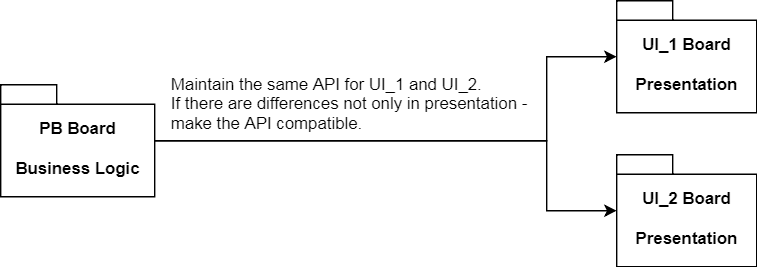
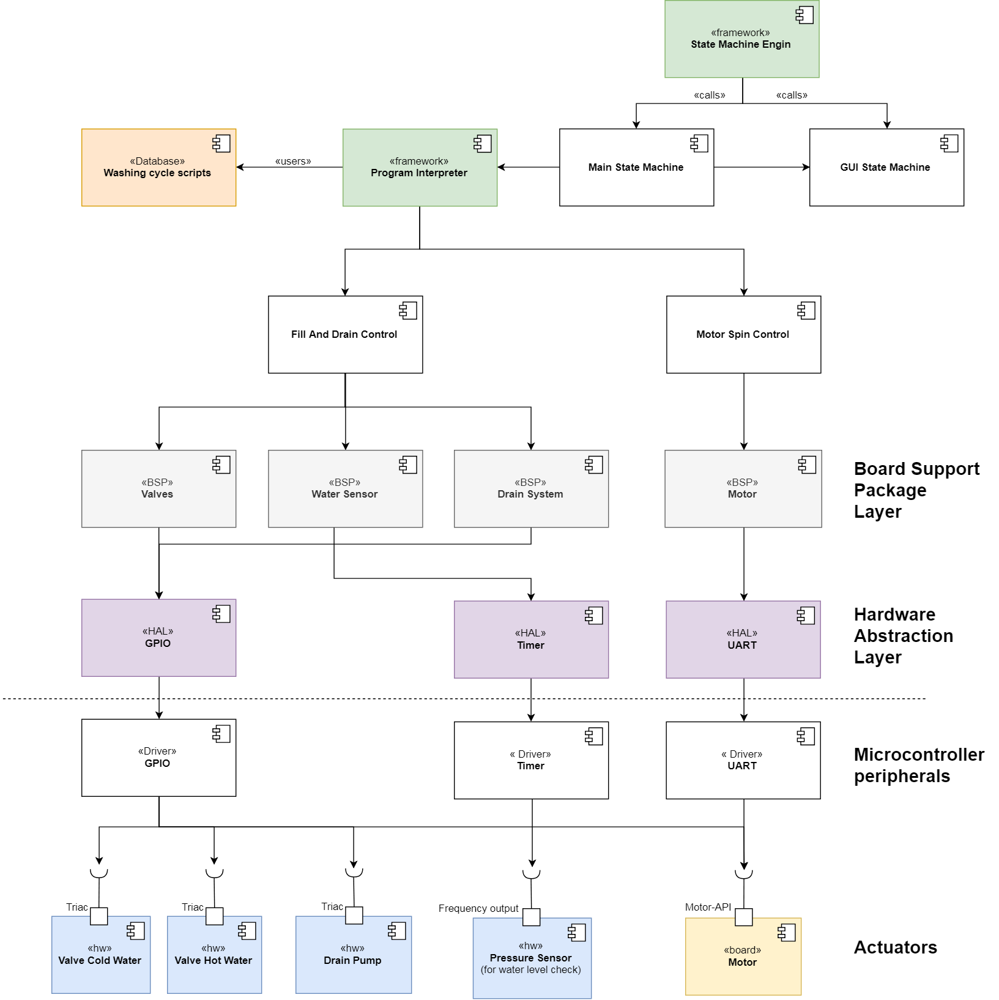

*****************************************
Documentation part 1 - decomposition view
*****************************************

Background
----------
In all my years as a programmer I participated in several huge embedded
software projects. A huge project, in my view, stands for a multi-board project
with many of variants e.g. board to board combinations, that development lasts
over a year or two. This kind of projects involve several software teams,
dedicated separately to each board, group of requirement engineers, and bunch
of other people, and finally, so called managers...

Working in such project and environment:

- Requires expensive complexity management
- Requires multi-level system engineering
- Suffers from communication and synchronization issues between the teams
- Needs constant and proper contractor-customer communication
- Depends on customer product specification maturity
- Requires good **systems**, **subsystems** and **code documentation**

There are many reasons why such a project may fail, get abandoned or rejected.
Most of the IT projects does not succeed in terms of time and money. However,
I do not want to yammer about a project issues, my todays goal is to elaborate
a bit on software development **documentation**.

Software architecture
---------------------
At the initial project stage selected people work on **SW architecture**.
There is no one definition of what **system architecture** is.

  *Architecture describes the basic organization of a system. It is embodied by
  its individual parts and their relations between each other and to their
  environment, as well as by the guidelines that manage the design and the
  development of the system.*

  -- IEEE Standard 1471

In general **software architecture** is about:

- decomposing the system into parts called components, modules, elements
- defining links between the parts by the means of interfaces

  + internal interfaces (inside the developed system)
  + external interfaces (for communication with outside world and environment)

- describing SW components tasks, functions and responsibilities
- presenting components interactions in functional view

System overview
---------------
In this section I would like to elaborate a bit on several aspects of the
system architecture's **decomposition view**. **Decomposition view** presents
decomposed system - its parts, components, elements and modules. Lets discuss
simple example of two boards:

- User interface board (**UI**)
- Power board (**PB**)

The **UI** board is kind of GUI that contains display and buttons. In case of
washing machines **UI** board typically contains buttons, jog or rotator for
program selection (that can be illuminated) and a display e.g. LCD or LED version.
It is located at the top panel of the washing machine - everyone probably saw it...
The **PB** board contains all drivers required for washing machine operation such
as motor control driver, valves driver, heater driver, etc. By the driver I mean
electronic circuitry for driving the certain actuator (motor, valve, heater).

This kind of two board solution is a typical embedded system example. Lets
think a bit what both boards firmwares should look like. In my experience it
is a good approach to make **UI** board totally *stupid*. It means that
all the business logic and data management shall be located on the **PB** board.
This solution has one huge advantage - if logic change is required,
only **PB**'s firmware has to be updated and analogously if data presentation
change is requested only **UI**'s firmware needs update. This is not always true
because it is usually hard to completely decouple both boards' software. In the
previous sentence is a small cheat. There is another big reason that stands for this solution
- it is an ability to replace the **UI** board with a different one (maybe another variant,
with some extra LEDs). Now, we have the same interface to both boards **UI_1**
and **UI_2**, so that **UI's** firmware can only focus on data presentation.

On the above picture I put a note regarding API compatibility. Lets imagine
that both boards ``PB`` and ``UI`` are connected by the ``UART`` interface. It is
reasonable to develop such ``UART`` protocol that is not prone to damage due to
protocol API extension. This can be easily justified - lets imagine the following
scenario.

1. Firmware for ``PB`` and ``UI_1`` is ready and working.
2. Now both ``PB`` and ``UI`` teams start working on new ``UI`` variant and lets
   call it ``UI_2``.
3. New ``UI_2`` variant has extra LED 7-segment display to show time of selected
   washing cycle (TTE - time to end).
4. Information about the TTE has to be delivered to the ``UI_2`` board.

The scenario shows the case where additional information has to be delivered to
``UI_2`` board, in contrast to ``UI_1`` board which hasn't got this data. This
means that protocol has to be extended by e.g. adding new message that conveys
the TTE number. At this point it is not a good idea to change firmware for first
variant ``UI_1`` - it just has to work properly when it receives TTE message
from ``PB``. Remember both ``UI_1`` and ``UI_2`` boards can used interchangeably
with the same ``PB`` board and the ``PB`` board is configured in a way that
it knows the variant of ``UI`` board to work with.

Decomposition view
------------------
OK, lets come back to the topic. The **decomposition view** shows modules
and components structure and features the links (interfaces) between those elements.

The example shows typical software **decomposition view**. Each component can be
treated as a ``.c``/``.h`` files (in C language) or as a group of those files that expose
certain API. This API can be described in the another view - **class
diagram**. The example features following:

- Components at the bottom represents electrical actuators and circuitries that
  expose steering interface e.g. ``triac`` gate input.
- Upper layer consists of ``Microcontroller Peripheral Drivers`` (this layer is
  usually provided by the microcontroller's vendor like **ST** or **TI**) and can
  be easily configured by provided tools e.g. **CubeMX** from **ST Microelectronics**.
- The ``Hardware Abstraction layer`` (``HAL``) is a layer that abstracts microcontroller's
  peripherals by exposing stable/frozen API to the application upper layers. As I said
  this frozen interface (bunch of predefined functions e.g. for controlling
  microcontroller's ``GPIOs``) shall not change when we replace the microcontroller
  from e.g. **STM32** to **MSP432**. The only change required is to update
  lower ``Microcontroller Peripheral Drivers`` layer.
- One layer above the ``HAL`` we can find ``Board Support Package`` layer. It is
  usually optional, however quite useful in many cases. The best example of this layer
  we can find in the popular **dev-kits** e.g. **Arduino**, **STM32 Discovery** or
  **MSP430 Launchpad**. Vendor provided examples for those boards contain predefined names
  for the existing hardware elements e.g. **LEDs** or **Buttons**. Take a closer look at the
  **Arduino** among the whole range of different **dev-boards** - they varies in hardware, while
  software developers use mnemonic ``1``, ``2``, ... for digital pins and ``A0``, ``A1``, ... for
  analog pins. The developer does not know which microcontroller's port or pin
  is hidden behind the mnemonics. This makes it very easy for the vendor
  to produce various **dev-kits**, and developers are able to run the same software on it
  (no change are required - or small adjustments). Configuration of the board is done
  by the vendor in ``Board Support Package`` layer.
- The *green* components represent ``Framework`` modules. ``Framework`` is a layer
  that provides elements that can be used among the software layers
  (usually from ``HAL`` up). Usually ``Framework`` layer contains of global components (Utilities/Libraries).
  In the example I put ``Program Interpreter`` and ``State Machine Engine``.
  The ``State Machine Engine`` component can be treated as a scaffolding for
  underlaying state machines.
- The ``Washing cycle scripts`` component is a database that holds washing
  cycles definition encoded in a custom scripting language. The scripts are
  used and executed by the ``Program Interpreter``, which understands the commands
  and delegates its execution to the ``xxx Control`` components (low level
  algorithms and actions).
- The rest of the components resides in a so called ``Business Logic`` layer. Those
  modules implement the program logic (e.g. state machines for controlling
  the device and GUI - both communicated with each other).

Conclusion
----------
This article defines **software architecture** definition and provides an example
of its fundamental view which is **decomposition view**. The decomposition view is
used to show software components and interfaces that link them together. The
interface indicates what API is exposed by the particular component. The
**decomposition view** is supplemented by the textual components description.
This description should give an overview what tasks and responsibilities
belongs to the components. When we develop the **decomposition view** is it
crucial to know the interfaces between the components. It gives you the ability
to correctly find missing modules or to decide whether to shift some
component's tasks to other component. In the next article I would like to
present you a way how to describe the interface and how to utilize it when
defining the software's **functional view**.

**Footnote**

**kaeraz**, 2018/11
