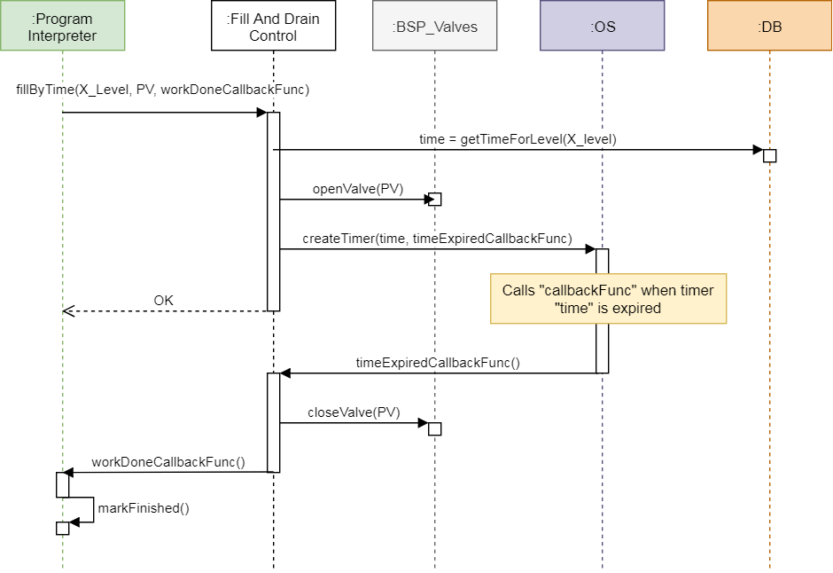

*****************************************************
Documentation part 2 - interfaces and functional view
*****************************************************

Step back
---------
Last time we discussed software **decomposition view** which is one of many
views of a **software architecture** that you are likely to use when documenting
you system. The **decomposition view** enables the designer to look deeply into
the software system and break it down into software modules and components.
I owe you an explanation what the component is. Please see below a texbook
definition.

A **component**:

- is part of software developed for re-use
- supports information hiding
- its functionality is exposed via **interfaces**
- implements functionality
- can consist of many components (composite component)

In practice,

  *component is a group of source files that implements some
  meaningful (in terms of a system) functionality, that can be abstracted
  as a software part. Other software parts can operate with it through known
  group of methods - component's interface. This software part can be, of course,
  composed of many other software parts that work together and communicate with
  each other in defined way. We can say that a component implements some part
  of the software system and can be analyzed separately from other software parts.*

Interfaces
----------
The concept of an **interface** enables the designers to connect system parts
and understand how they communicate with each other. In other words, it shows
what the component does and what doesn't.

To be clear an precise the **interface**:

- is a list of inputs (e.g. methods) that tell the component to process (do
  something) and give back an output (result)
- separates the declaration (which shows what things component does) from
  implementation (how component does the things)
- is a contract that component supports defined interface methods
- is a black-box in terms a view at the component

Above description is sometimes confusing. To put it as simply as possible,

  *an interface is a list of functions, methods, operations and component which
  has such an interface obligates itself to implement it. By the means of the
  interface you are able to invoke some component's code and get its result.*

Functional view
---------------
It's time to discuss how interfaces and components are utilized in practice.
Knowing the module's interface ahead of time has many advantages, however
it is not always possible to realize. The modeling such as software designing
might be a tool that can help you to examine modules communication and
corresponding interfaces. Prior to modeling you should prepare a list of
use cases or functionalities that you might want to achieve by the software.
Start with big picture and break it down into smaller scenarios. Below you
can find a list of exemplary functionaries in connection to filling the
water into a washing machine.

- Filling shall be executed to the defined level
- It is possible to select water inlet (valve) for different program steps
- Filling shall be executed by the time manner
- Use pressure water level sensor to check water level
- Monitor water level while filling to prevent overfilling
- etc.

Below I would like to present some of the functionalities presented in
a **sequence diagram** using modules interfaces. Doing this on paper actually
helped me to investigate what the interfaces should look like. The **sequence
diagram** is a tool which shows particular communication scenario and
features links and interactions between the software modules. Set of such
dynamic diagrams forms a architecture **functional view**. The **functional
view** focuses on modules communication to realize particular system function.

**Footnote**

**kaeraz**, 2018/11
