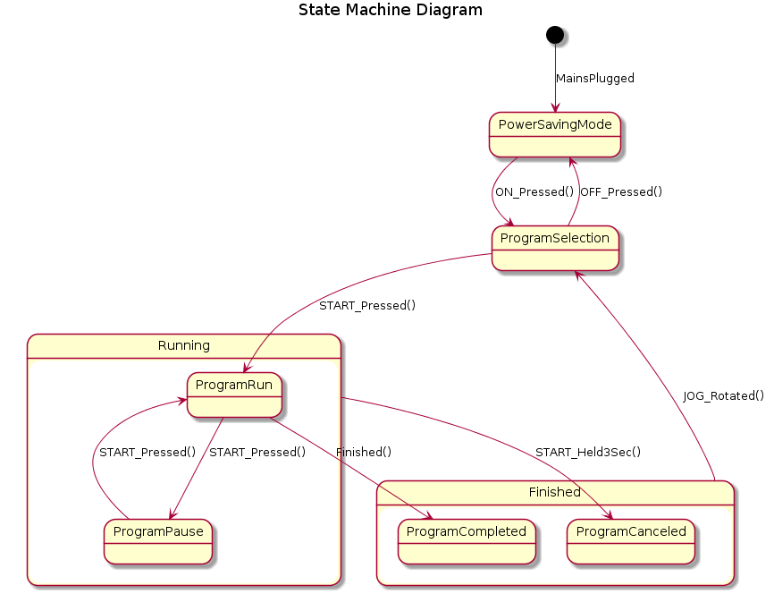

*****************************************************
Documentation part 3 - state machine
*****************************************************

Topic introduction
------------------
Nature of a typical software developer is fickle. One starts a project,
and in a big hurry rushes to code. The code grows and when contain
a thousand of lines it becomes obvious that it may be worth to care about its
documentation. A documentation is uncommon and festive, like a salary, once
in a month, and usually misused. Lots of engineers suffers from missing
documentation - they who develop needs to share with their coworkers, while they
who maintain the product have to worry about the code quality and consistency.
But, how can one be consistent if nobody instructed him why this particular
functionality has that shape? How one can extend the functionality having
only its intuition of what the current implementation is. Correct documentation
can be a solution.

Documentation
-------------
Project may have several documentation documents, where the following are
the common ones.

1. **Customer Specification**
  
  + Shows customer's point of view.
  + Describes customer's wishes.
  + Usually not consistent and incomplete.
  + Is maintained by the customer.
  
2. **Product Description**
  
  + Shows the contractor's understanding of the **Customer Specification**
  + Is complete and concise
  + Is enough and shows what is the subject of the contract
  + Is a base for the other contractor's documents
  + Is maintained by the contractor with support and consent of the customer
  
3. **Software Architecture**
  
  + Designs a system
  + Goes in accordance with **Product Description**
  + Is maintained by the contractor
  + Is a guideline for developers
  + Has rules how to do the Product
  + Ensures the usefullness of chosen structure

Missing design view
-------------------
In the previous article parts we went through various of methods
how to describe software system. The starting point was a **Decomposition view**,
then we move to a **Functional view**, and today we are going to discuss
a **State view**.

A **State view**,
  
  - shows behavior of a system using finite state transitions
  - can be described by a **State machine** UML diagram
  - can be applied to any software level from software part to software subsystem
  - usefull for systems that contains a state

There are many ways how to document state transitions however a **State machine**
UML diagram seems to be resonable to use.

State Machine
-------------
When we are familiar with a litte of the teory, it is a time to show
the **State view** == **State machine** diagram in practical example.
Let's suppose that we have a washing machine composed of two boards.

  - Power Board that operates the drivers and activators, and a
  - UI board responsible for showing the menu for the user.

The following diagram shows a **State machine** of a Power Board operation.

It needs a little bit of exmpanation. The **State machine** consists of several
states: ``PowerSavingMode``, ``ProgramSelection``, ``Running``, ``Finished``.
The ``Running`` and ``Finished`` states have of course internal states:
``ProgramRun``, ``ProgramPause``, ``ProgramCompleted``, ``ProgramCanceled``.

Al the states are connected by arrows indicating state transitions on given
action (trigger). In the diagram all triggers are beside the transition arrows.
Example shows several triggers that some of them are closely connected with the
UI boards: ``ON_Pressed()``, ``OFF_Pressed()``, ``JOG_Rotated()``,
``START_Pressed()``, ``START_Held3Sec()``, it has also Power Board internal triggers
like ``Finished()`` and environment triggers like ``MainsPluggerd``.

This is not the place to descibe how to draw **State machine** diagrams. My intention
is to provide you a hint that this kind of driagrams can be helpful in
software engineering. The exemplary **State machine** can be bundled with
a User Interface **menu diagrams**, so that user and developers can have a feeling
what system options are available to the user.

A **menu diagrams** shows what the screen looks like. It also depicts the transitions
between the menu screens on different user triggers (like **State Machine**).
Let's take a look at the following situation.

+----------------------------+----------------------------------------------------+
| Power Board state          | UI menu                                            |
+============================+====================================================+
| ``PowerSavingMode``        | - Screen is black.                                 |
|                            | - Reacts only to ``OFF_Pressed`` trigger.          |
+----------------------------+----------------------------------------------------+
| ``ProgramSelection``       | - Shows program selection screen.                  |
|                            | - User can select in example Spin Speed, Temp.,    |
|                            |   Start Delay, etc.                                |
|                            | - The ``START_Pressed`` trigger changes the        |
|                            |   Power Board's state.                             |
+----------------------------+----------------------------------------------------+
| ``ProgramRun``             | - Shows progress screen e.g. Time To End value.    |
|                            | - User can cancel the program by holding START     |
|                            |   button (emits ``START_Held3Sec`` trigger).       |
|                            | - User can pause the program by ``START_Pressed``  |
|                            |   trigger.                                         |
+----------------------------+----------------------------------------------------+
| etc...                     | etc...                                             |
+----------------------------+----------------------------------------------------+

It is quite handy to put a UI menu screen picture beside each Power Board's state.

Conclusion
----------
The **State Machine** diagram is a powerful tool to show stateful representation
of a system. It is particulary convenient in situations where two or more systems
have its own states and they have to communicate with each other in some way.
My personal feeling is that simple diagram is more valuable than a stack of text.

**Footnote**

**kaeraz**, 2019/02
